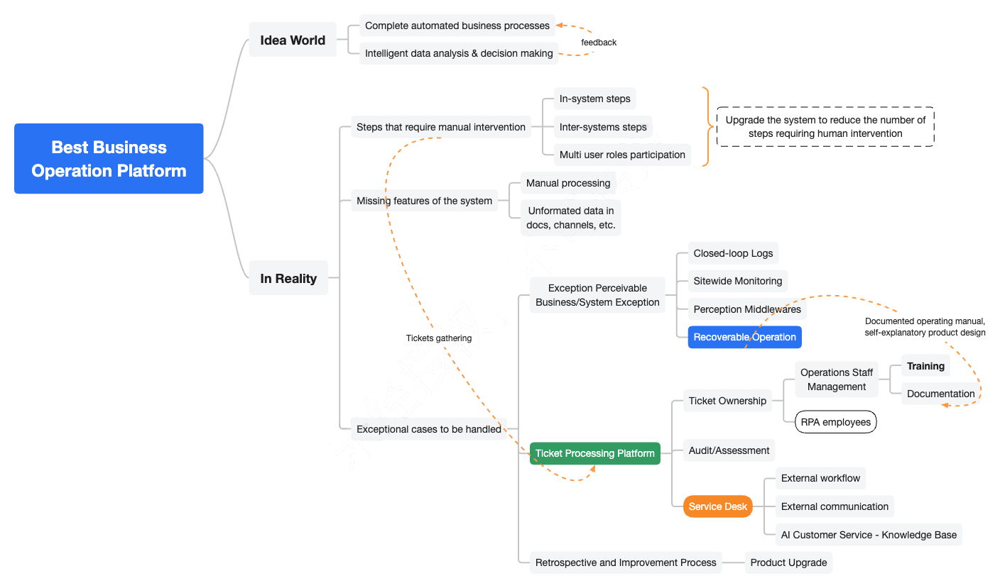

## The Challenge

When we set out to design an enterprise operation platform, we had a clear vision: to seamlessly track and process business tickets from customers or systems, we have these thoughts:

<!-- truncate -->

In a nutshell, we grappled with:

- Diverse, disconnected systems
- Multiple user roles with varying needs
- A mix of structured and unstructured data
- The need for workflow and process automation

## The Solution

To tackle these complex and dynamic business processes, we envisioned a tool with the following capabilities:

- Effortless integration of heterogeneous systems
- No coding required for integration
  - No need to learn new APIs
  - AI-powered service or user invocation
    - Semantic data mapping
    - Persistent asynchronous
    - Progressive invocation
- Natural language SOP orchestration

This vision led to the conception of Botlet.IO, built on these core principles:

- No business logic within Botlet.IO, just invocation and orchestration
- Systems and users function as equal services
- AI-powered semantic data mapping
- Seamless experience for all systems and users with embedded Botlet adaptors

## The Journey So Far

We swiftly developed a proof of concept:

- Integration with our Slack, Zendesk, and in-house k8s services
- Services can invoke related users via API, with users responding via Slack or email
- Users can interact with k8s services using natural language in Slack
- k8s exceptions are seamlessly integrated into our ticket processing platform
- External customers experience no differences, as they're approached via Zendesk

Now, we're in the exciting phase of developing Botlet.IO as an open-source product.

We warmly invite you to [try it out](https://docs.botlet.io/docs/intro), [share your thoughts](https://botlet.canny.io), or even [contribute](http://github.com/Botlet-IO/botlet-api).
