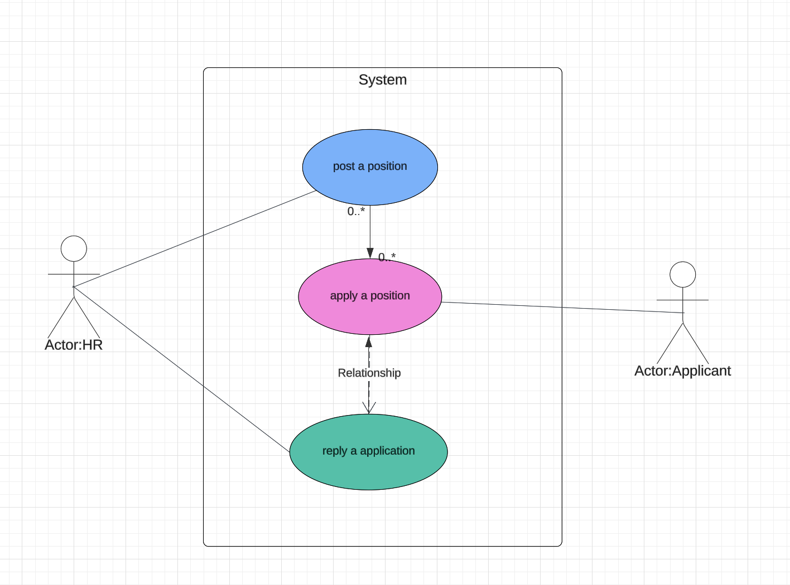

Assuming you are building a `recruit` tool for your company, you need to define the API for your users to interact with your tool. We just take 3 cases in `recruit` process for example:
1. publish a position
2. apply a position
3. reply the application

<figure>

</figure>

## Define the API

Firstly, generate the OpenAPI documentation using [Mistral](https://chat.mistral.ai), we can use a prompt like this:
```text
generate a OpenAPI documentation for 'Publish a position', 'apply a position' and 'reply to the applicant' in 'recruit' process
```

Then we can get a OpenAPI documentation like this:
<details>
<summary>Click to view apply-a-position.yaml</summary>

```yaml {3-5}
openapi: 3.0.0
info:
  title: Recruitment API
  version: 1.0.0
paths:
  /positions:
    post:
      summary: Publish a position
      requestBody:
        content:
          application/json:
            schema:
              type: object
              properties:
                title:
                  type: string
                description:
                  type: string
                location:
                  type: string
      responses:
        '201':
          description: Created
          content:
            application/json:
              schema:
                type: object
                properties:
                  id:
                    type: integer
                  title:
                    type: string
                  description:
                    type: string
                  location:
                    type: string
  /positions/{positionId}/apply:
    post:
      summary: Apply for a position
      parameters:
        - name: positionId
          in: path
          required: true
          schema:
            type: integer
      requestBody:
        content:
          application/json:
            schema:
              type: object
              properties:
                name:
                  type: string
                email:
                  type: string
                resume:
                  type: string
                  format: binary
      responses:
        '201':
          description: Created
          content:
            application/json:
              schema:
                type: object
                properties:
                  id:
                    type: integer
                  name:
                    type: string
                  email:
                    type: string
                  resume:
                    type: string
                    format: binary
                  position:
                    type: object
                    properties:
                      id:
                        type: integer
                      title:
                        type: string
                      description:
                        type: string
                      location:
                        type: string
  /applications/{applicationId}/reply:
    post:
      summary: Reply to an application
      parameters:
        - name: applicationId
          in: path
          required: true
          schema:
            type: integer
      requestBody:
        content:
          application/json:
            schema:
              type: object
              properties:
                status:
                  type: string
                  enum:
                    - accepted
                    - rejected
                feedback:
                  type: string
      responses:
        '200':
          description: OK
          content:
            application/json:
              schema:
                type: object
                properties:
                  id:
                    type: integer
                  name:
                    type: string
                  email:
                    type: string
                  resume:
                    type: string
                    format: binary
                  position:
                    type: object
                    properties:
                      id:
                        type: integer
                      title:
                        type: string
                      description:
                        type: string
                      location:
                        type: string
                  status:
                    type: string
                    enum:
                      - accepted
                      - rejected
                  feedback:
                    type: string
```
</details>

:::info
This specification file defines three endpoints: /positions, /positions/```{positionId}```/apply, and /applications/```{applicationId}```/reply.

The /positions endpoint supports the POST method for publishing a new position. The request body includes the title, description, and location of the position. The response includes the id of the newly created position, along with the title, description, and location.

The /positions/```{positionId}```/apply endpoint supports the POST method for submitting an application for a specific position. The positionId parameter is required to specify the position for which the application is being submitted. The request body includes the applicant's name, email, and resume. The response includes the id of the newly created application, along with the applicant's name, email, resume, and the position details.

The /applications/```{applicationId}```/reply endpoint supports the POST method for replying to an application. The applicationId parameter is required to specify the application for which the reply is being sent. The request body includes the status of the application (either accepted or rejected) and any feedback for the applicant. The response includes the id of the application, along with the applicant's name, email, resume, the position details, the status of the application, and any feedback.
:::

We are not going to implement the service from code. Actually we will create a `callgent` to forward all service requests to a human being by email, to execute the logic.

:::tip
The purpose of doing this is to quickly define a service and be able to connect it to other systems via RestAPI. The specific execution can be a person instead of a piece of code, which makes the person a part of the system.
:::
